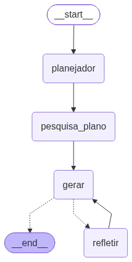

# Sobre o Gerador de Registro de Execução (PGD)

Esta aplicação ajuda o usuário a transformar um relato informal de atividades em um **registro de execução** formal, alinhado ao Programa de Gestão (PGD), utilizando um agente construído com LangGraph. A cada geração, o usuário escolhe o **provedor de modelo**: Gemini ou Azure OpenAI.

## Antes de começar

1. **Chaves**: Providencie as credenciais do provedor de modelo que for usar e as registre na aba **Chaves**:
    1. **Gemini**: informe a `GEMINI_API_KEY` (Tavily é opcional).
    1. **Azure OpenAI**: antes de abrir a aplicação, instale o Azure CLI e execute `az login --tenant SEU_TENANT` (a autenticação é feita pela sua conta Microsoft Entra ID, sem chave de API). Depois, informe `AZURE_OPENAI_ENDPOINT`, `AZURE_OPENAI_DEPLOYMENT` e `AZURE_OPENAI_API_VERSION` na aba **Chaves**.
1. Alimente, via aba **Base Adicional**, a aplicação com arquivos relevantes para o seu registro. Plano de Entregas, ou de trabalho, ou ainda definições, são sugestões, mas fica a seu critério.
1. Verifique se os **Prompts** estão de acordo com o tipo de registro que você quer produzir. Na aba correspondente, eles podem ser editados, mas não exclua nenhum. Mantenha o formato json.

## Como funciona

Vá para a aba **Principal** e siga estes passos:

1. **Gerar Base**: na primeira execução, o usuário carrega a base de conhecimento (RAG), composta por:
    1. páginas normativas oficiais (e seus PDFs vinculados);
    1. todos os arquivos `.md`, `.txt` e `.pdf` colocados na pasta `base_adicional` (incluindo os documentos fornecidos no projeto).

   Essa base fica salva em disco e é carregada automaticamente nas próximas vezes que a aplicação for aberta — o botão passa a se chamar **Regerar Base**, e a tela mostra a data e hora em que ela foi gerada pela última vez. Sempre que você anexar ou remover arquivos na aba **Base Adicional**, clique em **Regerar Base** para que essas mudanças passem a valer.
1. **Provedor de modelo**: escolha entre **Gemini** e **Azure OpenAI** antes de gerar o registro; a escolha vale para aquela geração (e para as revisões dela).
1. **Relato**: o usuário descreve, de forma livre, o que fez ou o que sua unidade fez no período.
1. **Geração do registro**: o agente segue o fluxo abaixo para planejar, pesquisar, redigir e revisar automaticamente o registro.
1. **Revisão sob demanda**: após a primeira geração, o usuário pode solicitar novas revisões a qualquer momento, podendo acrescentar material adicional por meio de um modal.
1. **Prompts configuráveis**: os quatro prompts que orientam o agente podem ser editados diretamente pela interface, na aba "Prompts", e ficam armazenados em `prompts.json`.

## Fluxo do agente (LangGraph)

- **planejador**: organiza o relato do usuário em um esboço estruturado.
- **pesquisa_plano**: gera consultas e recupera contexto relevante, restrito às fontes normativas e aos documentos locais indexados.
- **gerar**: redige o registro de execução, incorporando o plano, o contexto pesquisado e, quando houver, o rascunho anterior, a crítica e material adicional informado pelo usuário.
- **refletir**: analisa o rascunho gerado e produz uma crítica com recomendações.
- O ciclo `gerar -> refletir -> gerar` ocorre automaticamente uma vez na primeira geração, e pode ser repetido manualmente pelo usuário por meio do botão "Solicitar revisão".

## Principais controles da interface

- **Provedor de modelo**: alterna entre Gemini (chave de API) e Azure OpenAI (login via Azure CLI/Entra ID).
- **Criatividade**: ajusta a temperatura do modelo, de respostas mais sóbrias a mais criativas.
- **Gerar Base / Regerar Base**: cria ou atualiza a base RAG; o rótulo e a data da última geração mudam conforme já exista ou não uma base salva.
- **Solicitar revisão**: abre um modal para que o usuário, opcionalmente, acrescente material adicional antes de uma nova revisão.
- **Aba Processo**: mostra o passo a passo completo da geração, incluindo o contexto de pesquisa recuperado e as críticas realizadas.
- **Aba Prompts**: permite editar e validar, em formato JSON, os prompts usados pelo agente.
- **Pasta base_adicional**: permite acrescentar quantos documentos locais forem necessários para enriquecer o contexto do RAG. Subpastas também são lidas.

## Restrições de pesquisa

A pesquisa do agente é restrita às fontes configuradas no RAG (páginas normativas, PDFs vinculados e documentos locais do projeto). Não há busca livre na internet.
